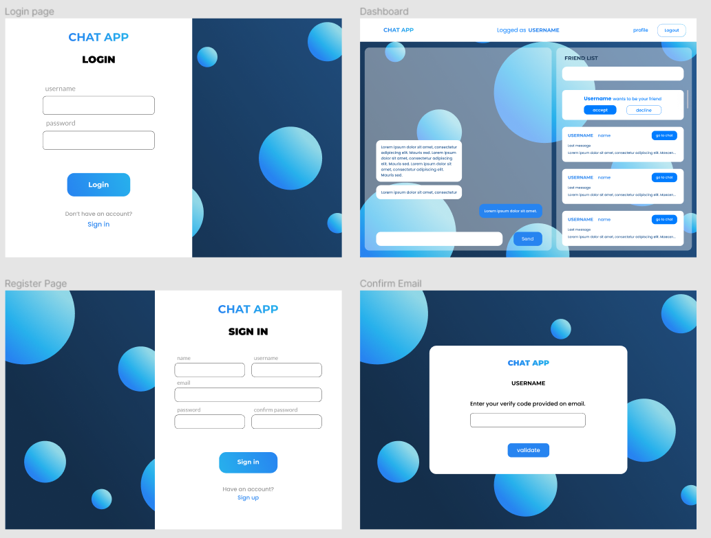
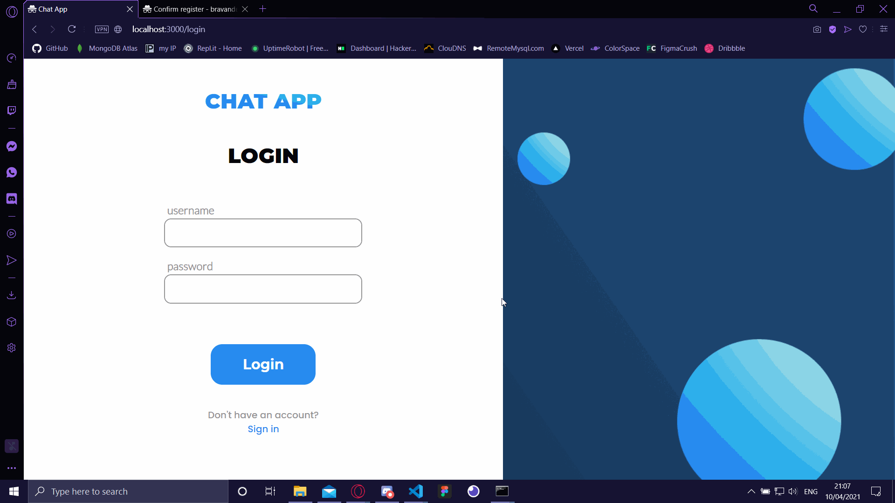
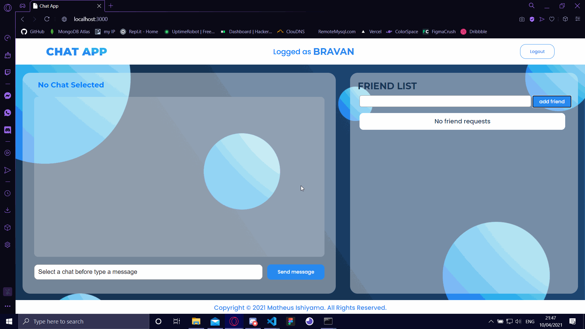
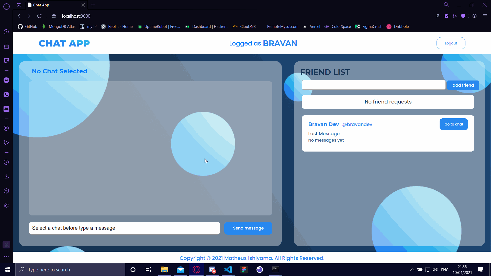

# Chat app (frontend)

This a real time chat with socket.

**Screens**

I create this wireframes in `Figma`, you can see file [here](./assets/chat-app.fig).

## How it works?

First you need to create and confirm email.

After you register and confirm, you can login with `username` and `password`

You can send friend request to your friend, just need his `username`.

And chat xD

---

If you wanna see backend click [here](https://github.com/MatheusIshiyama/chat-app-backend).

**Developed by Matheus Ishiyama**